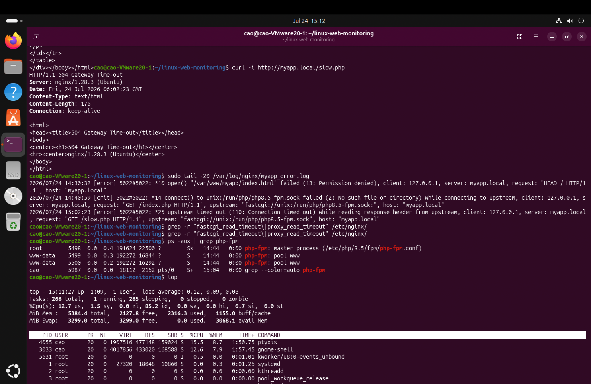

# 障害対応記録 05：PHP処理遅延による504 Gateway Time-out

## 1. 障害概要

| 項目 | 内容 |
|---|---|
| 対象サービス | Nginx / PHP-FPM |
| 障害種別 | 504 Gateway Time-out |
| 発生事象 | PHPページへのアクセスがタイムアウトした |
| 影響 | 対象PHPページを表示できない |
| 対象URL | `http://myapp.local/slow.php` |

---

## 2. 障害の再現

処理時間の長いPHPファイルを作成した。

```bash
echo '<?php sleep(120); echo "done"; ?>' | sudo tee /var/www/myapp/slow.php
```

アクセスを実行した。

```bash
curl -i http://myapp.local/slow.php
```

約60秒後、以下のレスポンスが返された。

```text
HTTP/1.1 504 Gateway Time-out
Server: nginx/1.28.3 (Ubuntu)
Content-Type: text/html
```

### スクリーンショット



---

## 3. 確認手順

### 3.1 Nginxエラーログの確認

```bash
sudo tail -20 /var/log/nginx/myapp_error.log
```

確認したログ：

```text
upstream timed out (110: Connection timed out)
while reading response header from upstream
request: "GET /slow.php HTTP/1.1"
upstream: "fastcgi://unix:/run/php/php8.5-fpm.sock"
```

このログから、NginxはPHP-FPMへ接続できていたが、応答を待っている途中でタイムアウトしたと判断した。

### 3.2 PHP-FPMプロセスの確認

```bash
ps aux | grep '[p]hp-fpm'
```

確認結果：

```text
root      ... php-fpm: master process
www-data  ... php-fpm: pool www
www-data  ... php-fpm: pool www
```

PHP-FPMプロセスは稼働していたため、サービス停止による502ではないと判断した。

### 3.3 CPU・メモリ使用状況の確認

```bash
top
```

主な確認項目：

- `load average`
- `%Cpu(s)` の `id`
- `MiB Mem` の `available`
- `MiB Swap` の使用量
- PHP-FPMプロセスの `%CPU` と `%MEM`

CPUとメモリに大きな逼迫は確認されなかった。

### スクリーンショット


---

## 4. 原因

`slow.php` に記述した以下の処理が原因である。

```php
<?php sleep(120); echo "done"; ?>
```

PHP処理が120秒間停止したため、NginxがPHP-FPMからの応答を待ちきれず、FastCGIの読み取りタイムアウトが発生した。

---

## 5. 対応

検証用の遅延ファイルを削除した。

```bash
sudo rm /var/www/myapp/slow.php
```

または、検証を継続する場合は待機時間を短くする。

```bash
echo '<?php sleep(1); echo "done"; ?>' | sudo tee /var/www/myapp/slow.php
```

---

## 6. 復旧確認

```bash
curl -i http://myapp.local/slow.php
```

正常時の確認結果：

```text
HTTP/1.1 200 OK

done
```

### スクリーンショット


---

## 7. 502と504の違い

| ステータス | 状態 | PHP-FPMプロセス | 主なログ |
|---|---|---|---|
| 502 Bad Gateway | Nginxが上流へ接続できない | 停止している場合が多い | `connect() failed` / `No such file or directory` |
| 504 Gateway Time-out | 上流へ接続できたが応答が遅い | 通常は稼働中 | `upstream timed out` |

---

## 8. 学習内容

- 504は、Nginxが上流サーバーから時間内に応答を受け取れない場合に発生する。
- `error.log` の `upstream timed out` が重要な判断材料になる。
- `ps aux` でPHP-FPMの稼働状態を確認する。
- `top` でCPU・メモリ・負荷状況を確認し、リソース不足か処理遅延かを切り分ける。
- 502と504では、上流への接続可否が異なる。
