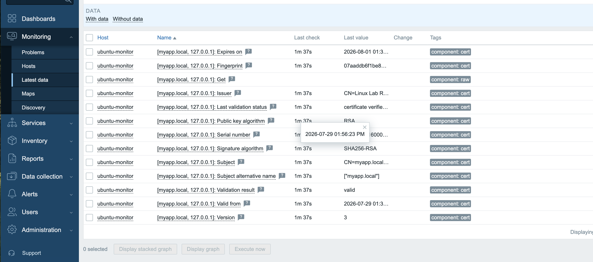
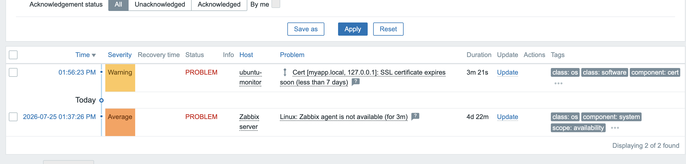
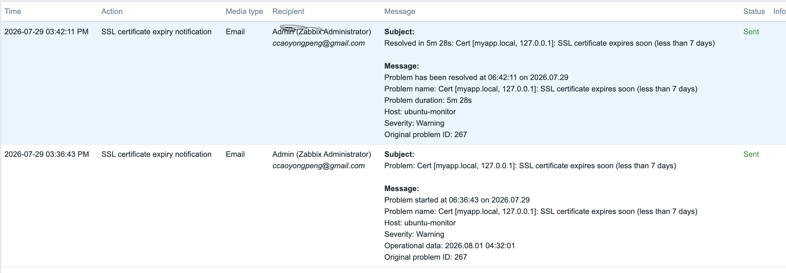
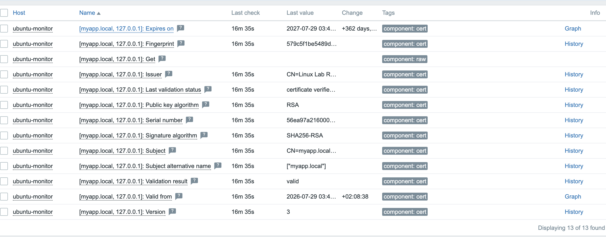

# Incident 08：ZabbixによるSSL証明書監視

## 概要

Nginxで公開している `myapp.local` のSSL証明書を、Zabbix Agent 2で監視しました。

有効期限3日のテスト証明書を使用し、アラート発生、メール通知、証明書更新、復旧確認までを実施しました。

## 環境

- Ubuntu 26.04
- Nginx
- Zabbix 7.4
- Zabbix Agent 2
- OpenSSL

## 監視設定

使用テンプレート：

```text
Website certificate by Zabbix agent 2
```

監視対象：

```text
https://myapp.local:443
```

警告条件：

```text
証明書の有効期限が7日未満
```

## 検知結果

有効期限3日の証明書を設定し、以下のアラートを確認しました。

```text
SSL certificate expires soon
```





メール通知も正常に送信されました。



## 復旧対応

証明書を365日有効なものへ更新し、Nginxを再読み込みしました。

```bash
sudo nginx -t
sudo systemctl reload nginx
```

更新後、アラートが自動的に復旧することを確認しました。



## 結果

- SSL証明書情報の取得：成功
- 有効期限アラート：発生
- PROBLEMメール：送信成功
- 証明書更新：成功
- RESOLVED確認：成功

> 秘密鍵はGitHubに登録していません。
